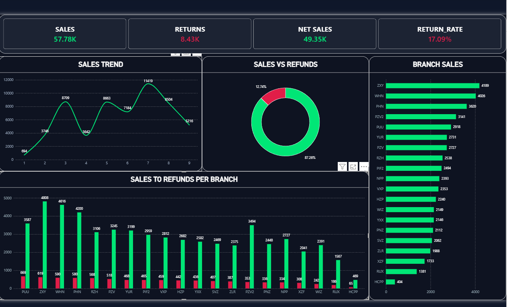

# 📊 Men's Retail Sales & Inventory Dashboard

An end-to-end Power BI analytics project evaluating net sales performance, store branch trends, and inventory distribution to support inventory replenishment and stock planning.

---

## 🖼️ Dashboard Preview

---

## 🛠️ Tech Stack & Key Features
- **Data Cleaning & ETL (Microsoft Excel & Power Query):** Text manipulation, handling return quantity logic (net sales calculations), data type conversions, and dynamic date tables.
- **Data Visualization (Power BI):** Custom DAX measures for net sales volume and revenue performance with fixed categorical axis formatting.
- **Retail Analytics:** Branch-level sales breakdown, category-wise performance, and stock turnover metrics.

---

## 🔗 Live Interactive Dashboard
👉  [View Repository Source & Files](https://github.com/sh3lan2/Retail-Sales-PowerBI)
